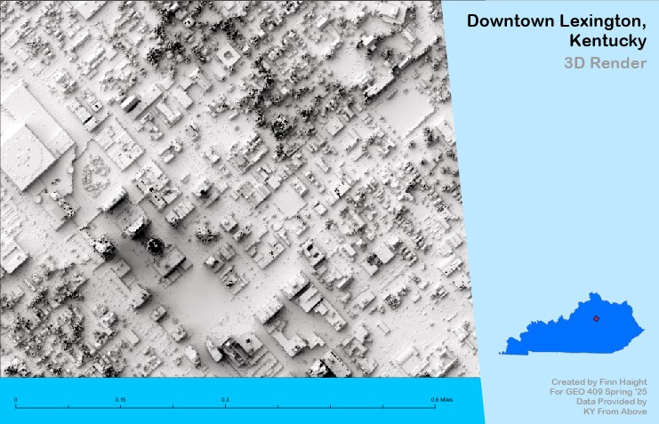
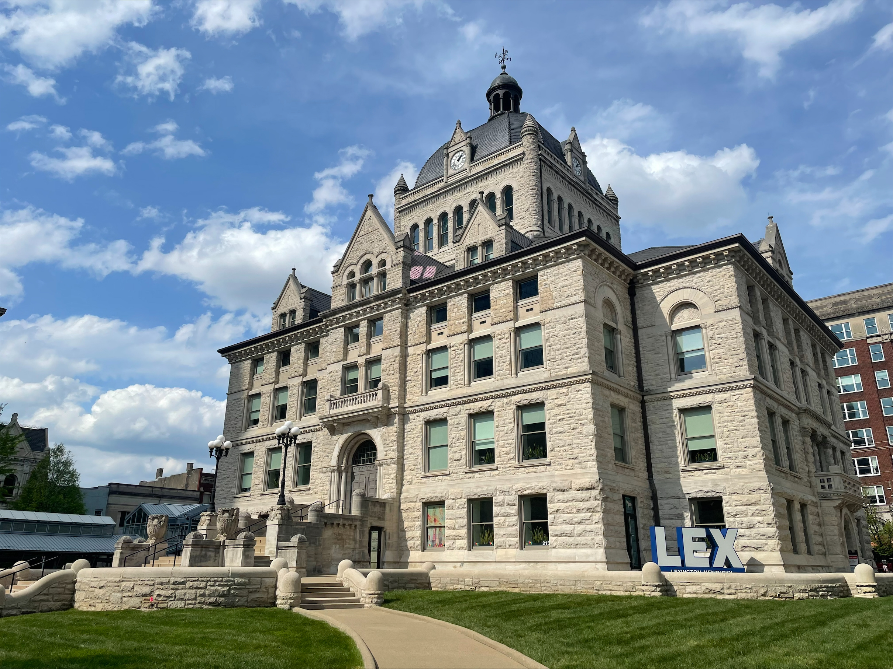
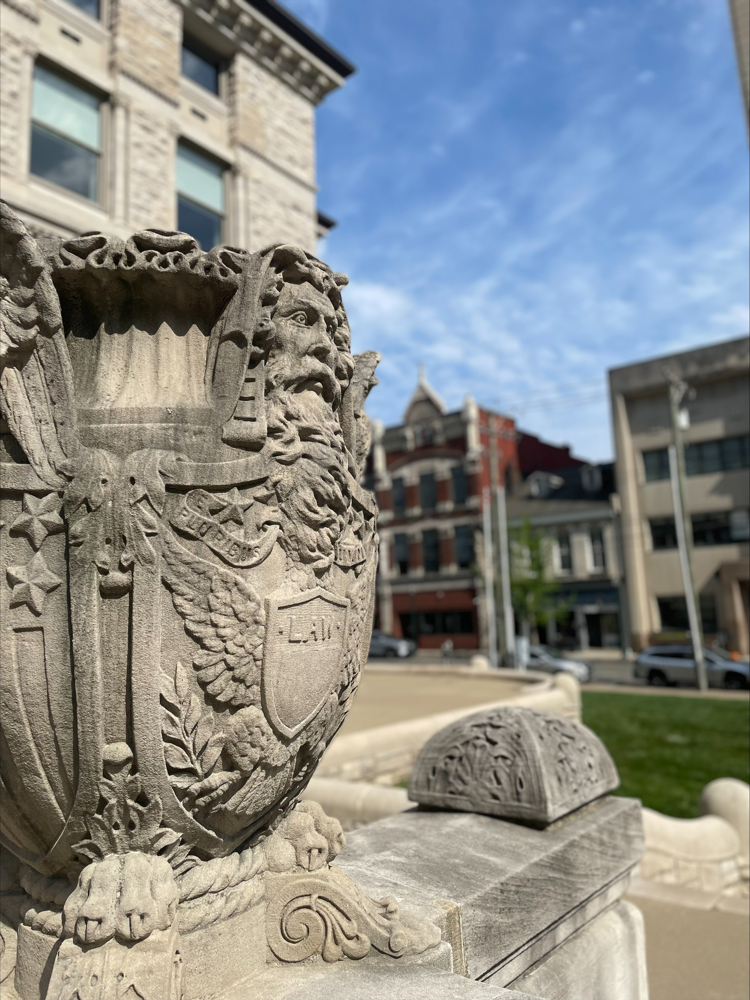
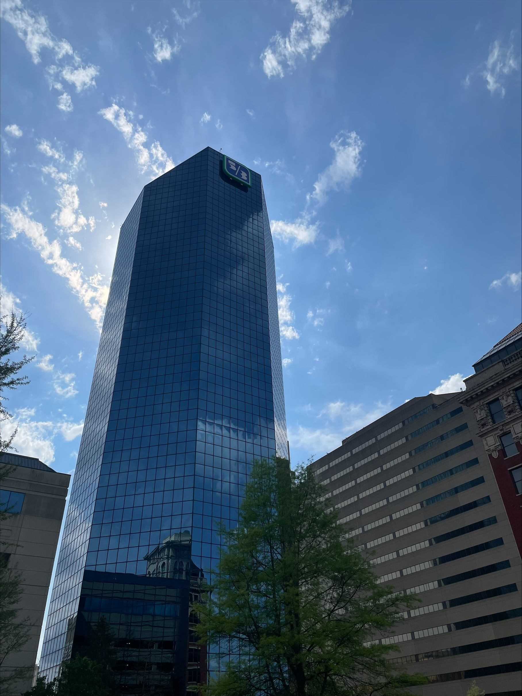
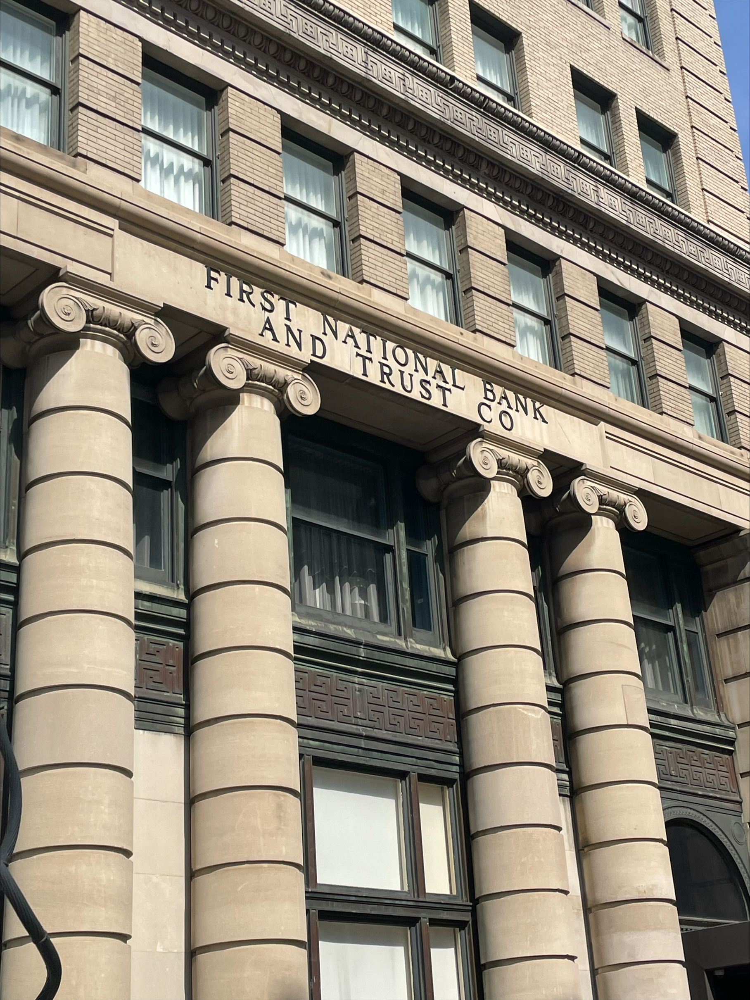

# Lab-07
# Lexington City Center
## Lexington, KY

Lexington is the second largest city in the state of Kentucky. While relatively small, it is home to vibrant communities, and it's densely packed city center demonstrates the contrast between historical and modern architecture that makes the area so interesting. The old courthouse, considered to be the true center of the city, is located just across the street from the 5/3rd building, the tallest building in the city. The contrast between these two landmarks is reflective of the city itself.

     
*Downtown Lexington*

[Link to high-resolution version](Lex.pdf)    

 Old Courthouse, Finn Haight

 Old Courthouse 2, Finn Haight

 5/3rd Building, Finn Haight

 Hotel, Finn Haight

Maps and Photos by Finn Haight. Data courtesey of KY From Above. Produced using ArcGIS Pro and Blender.